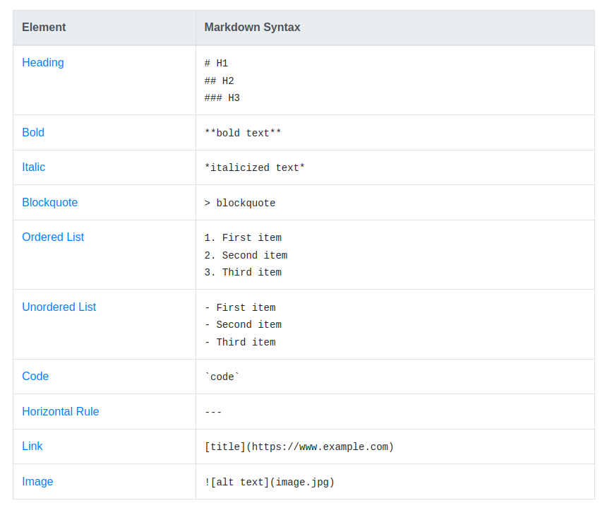
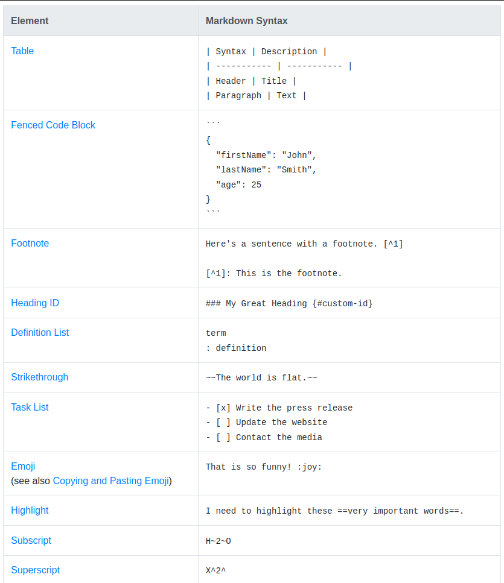

**Notes**

Learning markdown from [markdowntutorial](https://www.markdowntutorial.com/).

**Italics**   
 \_word\_ => _word_

 **Bold**  
 \*\*word\*\* => **word**

 **Bold and Italic**  
 \*\*\_word\_\*\* or  \_\*\*word\*\*\_ => **_word_**

 **Headers**  
use \# in front of headers, number of hashes represents type of heading 
# Header one
## Header _two_
- you cant make a header bold but can italicize 
### Header three
#### Header four
##### Header five
###### Header six

**Links**  
\[text to display\]\(URL\) => [google](www.google.com)

**Images**  
\!\[alt text\]\(image URL\) =>    

**BlockQuotes**  
\> Paragrah => 
> I am quoted text

**Lists**  
\* list1  
\* list2 =>
* list item 1
* list item 2 

1\. order item 1

2\. order item 2 =>  
1. order item 1
2. order item 2

> Ident tab space with  the \* or number if you want to add depth or nested lists as below

* level 1
    * level 2
        * level 3
            1. level order 4  
        
**Paragraphs**  
add 2 keyboard space for new line

cheat sheets from [markdownguide](https://www.markdownguide.org/cheat-sheet/)  

